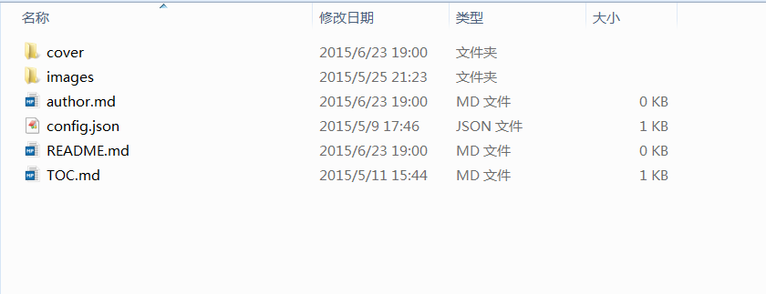

# 第三步 创建基础文件结构，开始编写

## 创建基础文件结构

通过前两节的介绍，你已经有了一个远程仓库，一个本地的仓库，仓库里有一个 README.md 的文件。知道了 Markdown 的基本用法，下面让我们开始创建基本的文件结构，在本地仓库文件位置 `C:\Users\Administrator\Documents\GitHub\test`下添加如下图所示文件和文件夹。

>注意：你的 GitHub 仓库的本地文件地址以克隆下来的地址为准。

### 文件目录详解

- **cover/** - 存放 [官网首页](http://wiki.jikexueyuan.com/) 背景图片（图片由极客学院提供，后期整理上线时，编辑会添加）
 - background.png 或 background.jpg
 - logo.png 或 logo.jpg
 
- **images/** - 存放图片（用到的图片文件都放在这）

- **author.md** - 作者简介（选填）

- **README.md** - 说明文档（**必须有**，默认 wiki 首页显示，相当于书籍的序）

- **TOC.md** - 目录（**必须有**，该 wiki 的目录）

- **config.json** - 书籍名称和介绍（选填）
  - "name": "书籍名称",
  - "introduction": "书籍内容简介。",
  
## 添加新文件

添加新文件，如下图：

>**重要**      
所有的文章 `md` 文件都直接放于仓库的根目录下，不要在根目录下新建文件夹。
  
**在新建文件时，按照以下文件命名规范：**

- Markdown 文件：英文小写（多个英文减号连接）；  
正确：copywriting-guide.md  
错误：copywriting_guide.md、copywritingGuide.md、CopywritingGuide.md、copywriting guide.md

## 在新文件上添加内容

1.目录 TOC.md

2.在对应的章节文件开始撰写内容

到此，你已经开始了创作整理的路程了，按照这样编写，我们还不能生成具有极客风格的书籍，下面一节，我们将讲解[极客学院文案风格指南](copywriting-guide.md)。